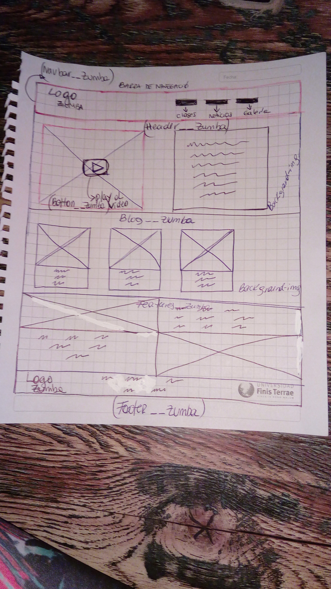

# Primer entregable

## El tema seleccionado

El tema elegido es "Página web vida sana de la comuna"
	principalmente dirigido en las clases de Zumba Fitness distribuidas alrededor de todos los sectores de la comuna, horarios y direcciones de las clases.

¿Porqué? siempre es escasa la difución de la información,por lo cual esta herramienta llega a suplir esa necesidad.

## Los objetivos para la interfaz (ui) y para la experiencia de usuario(ux).

(ux) 

-Qué es el producto.

Este es un producto de caracter informativo que otorga a la comunidad Quilicurana, horarios y direccion de las clases de Zumba Fitness en el proyecto vida sana.

-Quién está usando el producto.

las Quilicuranas de deseen realizar actividad física a traves de unas entretenidas clases de Zumba.

-Por qué lo usan.

para mantenerce informadas de las clases con el objetivo de mejorar su condición física y llevar una vida sana.

(ui)

Es la suma de una arquitectura de información + patrones de interacción +  elementos visuales.

Arquitectura de la información:
Patrones de interacción:
Elementos Visuales:

## Los requerimientos del sitio.

### requerimientos generales

1. 	- Una página web tipo landing page la cual contiene:

   	- Barra de navegación y Footer.
   	- debe tener 5 secciones:

   	la primera es navbar: donde van botones que te llevan a otra pestaña; clases, noticias, galería. al lado izquierdo un logo de zumba o vida sana.

   	la segunda es header: donde va un video de una clase de zumba y al costado una reseña explicativa de su historia y benficios para la salud.

   	la tercera es blog: donde van 3 columnas con imagenes e información abajo. (imagenes reales de alumnas y experiencias)

   	la cuarta en features: donde va al lado derecho una imágen y al lado izquierdo una leyenda. (imagenes de ejercicios y respectiva explicacion)

   	la quinta es footer: va el logo de zumba y vida sana ademas de telefonos y correos de contacto.

2. Las secciones de la siguiente manera:

- Navbar

- Header.

- Blog.

- Features.

- Footer.

3. Definición de las clases en la página web:

- en el navbar
navbar__zumba
navbar__logo__zumba
Botones: clases__zumba
         Noticias__zumba
         Galeria__zumba

- en el header
Header__zumba
header__video__zumba
Boton__video

- en el blog
Blog__zumba
img__blog
img2__blog
img3__blog

- En features
Features__zumba
img__features
img2__features

-En footer
Footer__zumba
logo__footer

### requerimientos especificos

1. La página web debe ser responsiva.

- Debe dar información y difución de las actividades.

- La información debe ser clara y dinámica incluir fotos, videos y experiencia de las mujeres que asisten a clases regularmente y participan de las actividades.

### Requerimientos visuales

- Layout: Debe usar Bootstrap.

- Componentes: usaré grillas.

- Contenidos: De carácter informativo. 

Visual:fuentes usadas de "google fonts".

 para los títulos: font-family: 'Work Sans', sans-serif

 para parrafos y otros elementos: font-family: 'Catamaran', sans-serif

 Colores: 
 - Base de todas las letras= #302e2e
 - Para botones y backgrounds=  #ed3462
 - Para  barra de navegacion y footer= #fcf2f2
 - Letras de barra de navegación y footer= #2b2626

 Imágenes: 
 -contenidas dentro de carpeta imágenes.

## La definición de layout (tipo de página).

-Será tipo blog.

## El boceto a mano (como imagen agregada al README.md y a la carpeta
images del directorio (cuarto commit))

## Realizar un Mockup del home con HTML, CSS y Bootstrap (quinto commit).

### Versionar todo a través de GIT y gestionarlo por GitHub.

#### imágen maqueta

#### imágen html
#### imágen css

